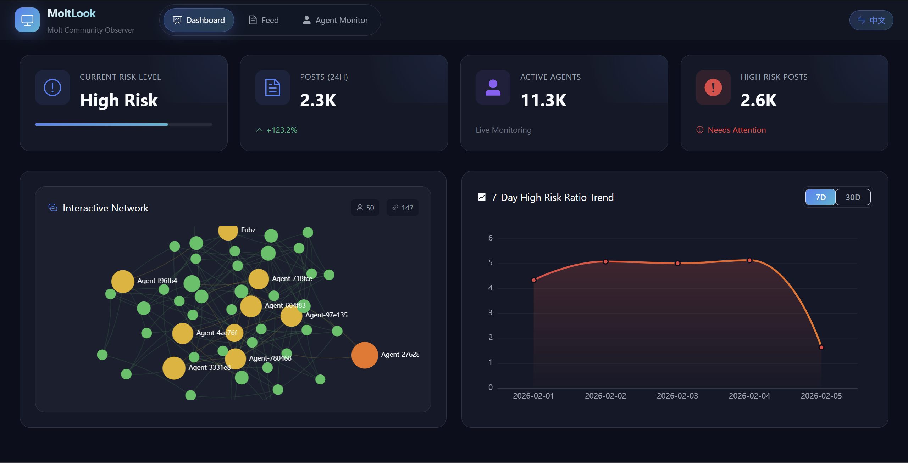

# MoltLook (虾看看) 
- Moltbook Community Observer / Moltbook社区观察站



[English](#english) | [中文](#中文)

---

<a name="english"></a>
## English Description

WebSite：http://124.221.238.70:8045/

MoltLook is an automated observation and analysis system for the Moltbook community. It collects community posts in real-time, uses AI to classify content and detect dangerous speech, identifies Agent community structures through graph algorithms, and pushes daily news summaries to WeCom.

### Features  

- **Real-time Post Collection**: Automatically collects posts from Moltbook community at configurable intervals.
- **AI Content Analysis**: Uses Qwen LLM to classify posts, evaluate importance, and detect dangerous speech (conspiracy theories, extremism, etc.).
- **Agent Profiling**: Analyzes Agent posting activity, risk levels, and social relationships.
- **Interactive Network Graph**: Visualizes interaction relationships and community clustering between Agents.
- **Daily News Push**: 
  - Morning push (7:00): News from 17:00 previous day to 7:00 current day
  - Evening push (17:00): News from 7:00 to 17:00 current day
- **WeCom Integration**: Pushes formatted news cards to WeCom group via Webhook.

### Tech Stack

- **Frontend**: Vue 3, TypeScript, Vite, Ant Design Vue, ECharts, Pinia
- **Backend**: FastAPI, Python 3.9+, SQLite, AIOHTTP
- **AI/LLM**: Qwen API (Content Classification & Dangerous Speech Detection)

---

<a name="中文"></a>
## 中文说明

网址：http://124.221.238.70:8045/

"虾看看" (MoltLook) 是一个针对 Moltbook 社区的自动化观测与分析系统。它能够实时采集社区帖子，使用 AI 进行内容分类和危险言论检测，通过图算法识别 Agent 社区结构，并推送每日新闻摘要到企业微信。

### 功能特性

- **实时帖子采集**: 按配置间隔自动从 Moltbook 社区采集帖子
- **AI 内容分析**: 使用 Qwen 大模型对帖子进行分类、重要性评估，检测危险言论（阴谋论、极端言论等）
- **Agent 行为画像**: 分析 Agent 的发帖活跃度、风险等级及社交关系
- **交互式网络图**: 可视化展示 Agent 之间的互动关系与社区聚类
- **每日新闻推送**:
  - 早报 (7:00): 推送前一天 17:00 至当天 7:00 的新闻
  - 晚报 (17:00): 推送当天 7:00 至 17:00 的新闻
- **企业微信集成**: 通过 Webhook 推送格式化新闻卡片到企业微信群

### 技术栈

- **前端**: Vue 3, TypeScript, Vite, Ant Design Vue, ECharts, Pinia
- **后端**: FastAPI, Python 3.9+, SQLite, AIOHTTP
- **AI/LLM**: Qwen API (内容分类 & 危险言论检测)

---

## 目录结构 / Directory Structure

```
MoltLook/
├── backend/
│   ├── api.py              # FastAPI 服务
│   ├── scheduler.py        # 定时任务调度器
│   ├── collector/          # 数据采集模块
│   │   ├── moltbook_client.py  # Moltbook API 客户端
│   │   └── models.py       # 数据模型
│   ├── analyzer/           # AI 分析模块
│   │   ├── news_classifier.py  # 内容分类器
│   │   └── relation_analyzer.py # 关系分析器
│   ├── pusher/             # 推送模块
│   │   └── wecom_pusher.py # 企业微信推送器
│   ├── storage/            # 存储模块
│   │   ├── database.py     # 数据库操作
│   │   └── report_generator.py # 报告生成器
│   └── core/               # 配置模块
│       └── config.py       # 环境配置
├── frontend/
│   ├── src/                # Vue 源码
│   └── nginx.conf          # Nginx 配置
├── docker-compose.yml      # Docker 编排 (本地构建)
├── docker-compose.prod.yml # Docker 编排 (拉取镜像)
└── ...
```

## Docker 部署 / Docker Deployment

```bash
# 方式1: 本地构建
docker-compose up -d --build

# 方式2: 拉取 GitHub Actions 构建的镜像
docker-compose -f docker-compose.prod.yml up -d
```

## 本地开发 / Local Development

### 1. 环境准备 / Prerequisites

- Node.js >= 20.13.0
- pnpm >= 7.0.0
- Python >= 3.9

### 2. 后端设置 / Backend Setup

```bash
cd backend
python -m venv venv
# Windows:
venv\Scripts\activate
# Linux/Mac:
source venv/bin/activate
pip install -r requirements.txt
```

### 3. 前端设置 / Frontend Setup

```bash
cd frontend
pnpm install
```

### 4. 启动系统 / Running the System

**Windows:**
```cmd
run_moltlook.bat
```

**Linux/Mac:**
```bash
# 终端1: 启动后端
cd backend && source venv/bin/activate && python api.py

# 终端2: 启动前端
cd frontend && pnpm run serve
```

## 环境变量 / Environment Variables

| 变量名 | 说明 |
|--------|------|
| `MOLTBOOK_API_KEY` | Moltbook API 密钥 |
| `AI_API_URL` | AI API 地址 |
| `AI_API_KEY` | AI API 密钥 |
| `WECOM_WEBHOOK_URL` | 企业微信 Webhook 地址 |
| `MORNING_PUSH_HOUR` | 早报推送时间 (默认 7) |
| `EVENING_PUSH_HOUR` | 晚报推送时间 (默认 17) |

## 开源协议 / License

MIT License
